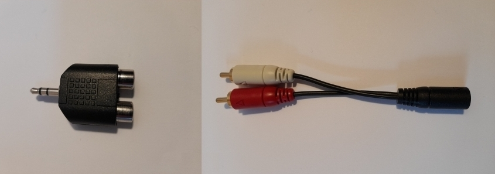
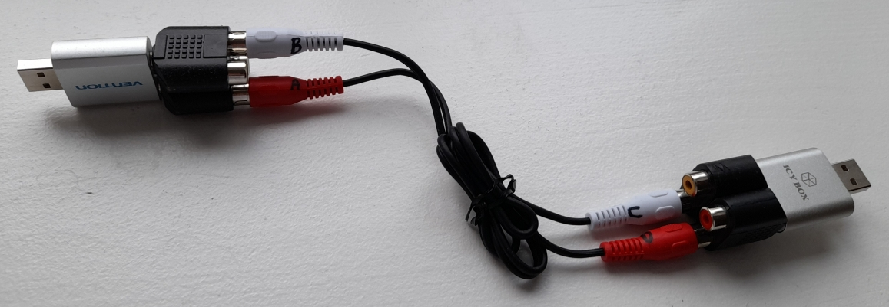

# tea2adt
tea2adt is a command-line utility for Chat, Remote Shell, Remote AI Prompt and File Transfer, that reads and writes encrypted data across peer-to-peer or broadcast audio connections, using [minimodem](https://github.com/kamalmostafa/minimodem "minimodem") and [gpg](https://github.com/gpg/gnupg "gpg").

It is a powerful tool that can be combined with any audio infrastructure (like PSTN, cellular network, internet, radio, walkie-talkies) to provide a secure communication channel through an audio tunnel.

The audio interfaces behave like data-diodes, each allowing unidirectional data transmission only, thus preventing data-leaks and malware-injection.

This enables an "enhanced"-end-to-end encryption (E-E2EE) which notably increases security and privacy, especially when the end devices are completely offline (air-gapped-system), thus providing an effective barrier against "legal or illegal" client-side-scanning!

See also <https://www.codeproject.com/Articles/5295970/Audio-Chat-for-Quite-Good-Privacy-AC4QGP>

# Recommendations
## Separation of Mic and Spkeaker
Many connections may require a special cable or cable adapter which separates the speaker from the mic in order to avoid coupling or interferences:



Here a complete example showing the USB sound cards, the adapters and the cable:



## Adapters
Special adapters may be used, e.g. to connect your offline device to a landline telephone:


### WARNING!
It is highly recommended to use external sound cards (e.g. a USB sound card for 5 EUR) to connect devices through their audio interfaces.
In some rare cases connecting a speaker to the microphone input may damage your audio interface.

Ideally, line in shall be used instead of a microphone input. It has a higher impedance and is therefore adequate to input the higher levels output by a speaker.

In contrast to mic, the line in is stereo.


### T/Y connectors
Adding T- or Y-connectors to output the signals to external speakers, headset or oscilloscope may be a huge help when diagnosing the system.
But be careful that this may increase distortions and errors.

Use such possibilities only if really necessary and be aware of the limitations.

As an alternative you can watch the current input audio signal with [Audacity](https://www.audacityteam.org/) - no additional connectors required.


## Digital audio connections
Although it is perfectly possible to connect the online and the offline devices through a 'digital' audio connection like Bluetooth or Socket, an analogue connection shall be preferred in order to assure a good isolation of the offline device.

The old good analog cables (e.g. 3.5mm, RCA) offer an important additional barrier against attacks.

While the digital transmission of audio information requires usually a client and a server running on both devices and also standardized communication protocols which are vulnerable to attacks, the plain analogue transmission of audio offers a much smaller attack surface.


## Volume levels
Make sure that the audio levels are set properly.

You may use the command "tea2adt -p" to send [test] telegrams to the communication partner.

For a start adjust all volumes at 50%.

It is advisable to keep the audio input level below 50% in order to not pick-up cross-signals, e.g. when using a headset.

Capture audio with [Audacity](https://www.audacityteam.org/) in parallel and make sure that the signal has no clipping (cut peaks) and is also not distorted in some other way.

If the signal is distored you may need to lower the baudrate in the configuration file cfg/baud until you see clear sine waves.

Once you find the correct values you can enter them in:
```
cfg/volume_microphone

cfg/volume_speaker_left

cfg/volume_speaker_right
```
Next time these settings will be used automatically. tea2adt sets the system audio levels for you.

To avoid automatic setting of volumes just leave the parameters empty.

### Volume when using walkie-talkies
When using walkie-talkies it may be important to fine-tune volumes in order to:
- get a good signal to noise ratio
- get a signal strong enough to drive the LE (activation by level)
- but no too strong in order to avoid clipping

## Configuration
### baud
The speed of communication over a data channel is limited by it's bandwidth.

You can e.g. use [Audacity](https://www.audacityteam.org/) to generate a frequency sweep and analyze the system response to determine the maximum possible rate of data transfer.

In most cases 1200 bit/s and 2400 bit/s work very well, but up to 9600 bit/s works perfectly in many cases.

Beyond that you may find it difficult to obtain a stable and reliable communication, although that of course is also possible under the right conditions.

Here an example of the spectrum in a communication over walkie-talkies. A landline telephone may show a similar profile:


### Timeouts
Another useful check with [Audacity](https://www.audacityteam.org/) is making sure that the configured delays and timeouts are correct.

For example, if cfg/retransmission_timeout_sec is too low you may see retransmissions before getting the acknowledge.
In that case just increase the value as required.

### start_msg
May be used to activate the walkie-talkie transmission and absorb glitches that sometimes appear at the beginning of transmissions.

### preamble, trailer
May be used to skip signal distortions at the beginning or end of a message.

### keepalive_time_sec
When using direct cable connections, life-signs may be required in order to keep a good signal quality.

Though, when using walkie-talkies, a start_msg may be required instead in order to maintain the communication for longer than 3 minutes. At least, that seems to be the maximum time that the specific devices I used tolerate in transmission mode.

Yet, when using messengers on a smartphone, like Skype or aTox, a preamble may be required instead.

## Security
The main security features are provided by [GnuPG](https://github.com/gpg/gnupg), also known as [GPG](https://github.com/gpg/gnupg).

The next level of security is provided by connecting the devices through the audio interfaces.

But the final and most important security step is to make sure that the device running tea2adt is offline!

If possible, the device has to remain offline all the time.

Remember also to switch off all other vulnerable interfaces such as bluetooth and USB, and even GPS. The goal is to keep your device fully air gapped.

## Shell
The shell is "persistent" over the complete session. 
This allows consecutive commands to remain in the same context (path, environment,..).

But not only the remote user can make use of the reverse-shell, also the local user can do it, e.g.:
### single command
```
echo "ls" > /home/user/tmp/tea2adt/tmp/pipe_shell_in
```
### interactive input
```
cat > /home/user/tmp/tea2adt/tmp/pipe_shell_in
```
### file input
```
cat file > /home/user/tmp/tea2adt/tmp/pipe_shell_in
```

# Environments
## Working environments
### Linux desktop native or virtualized on a Linux host
Up to now, most successful tests have been done with tea2adt in Linux-Desktop environments running natively or in a virtual machine inside Linux.

The offline device running tea2adt may connect through an audio cable to an online device carrying out an audio call, e.g.:
- Linphone (2400 bit/s)
- messenger, e.g. qTox or aTox (2400 bit/s, 1200 bit/s)
- walkie-talkies (700 bit/s)

or it may connect directly through an audio cable to another offline device (9600 bit/s).

Note that the online device may be a smartphone, desktop PC, walkie-talkie or anything else: tablet, laptop, landline telephone, ...

### Termux (Android 9)
tea2adt can also be easily installed in Termux. See [instructions](https://github.com/ClarkFieseln/tea2adt/blob/main/doc/Termux/instructions.md) for more information.

Positive tests done with 2 offline smartphones with tea2adt running in Termux on Android9 at 2400 bit/s. These devices communicate over 2 PCs, each running qTox with a call session between them.

## Not working environments
Initially, some other environments have been shortly tested without much success:

### cygwin in Win11
- amplitude test failed
- need to create a symbolic link to the following file:
  ```
  ln -s "C:\minimodem-master\src\minimodem.exe" minimodem
  ```
- need to call minimodem like this:
  ```
  ./minimodem --rx 2400
  ```
- need to install gnupg as a cygwin package for GPG
- but then GPG did not work as it was not showing anything after password detected

### VM Ubuntu 22.04.1 LTS in Win11
- OK, but big delay for audio input in Ubuntu (approx. 2 seconds!) and bad audio quality!
- need to set Display in VirtualBox to VBoxSVGA to avoid errors
- GPG was not even showing that it detected a password - probably stream with errors, not only the delay was a problem

### WSL2 in Win11
- chopped audio - probably saturation or problems with the audio format
- can only receive audio correctly

### Andronix Ubuntu 22.04 (not modded) in Termux (Android 9)
- use in Termux alone not possible because gpg could not be installed
- use in 'not modded' Ubuntu 22.04 from Andronix, running in Android 9 not possible due to missing audio support of VNC client
- audio support in most VNC clients seem to be a special feature offered by paid releases
- other free distros like Debian or alternatives to Andronix like UserLAnd and AnLinux are also accessed via VNC
- the modded OSs in Andronix seem to have a better audio support but they are not free
- anyways, big delays expected in all of these alternatives

### Kali NetHunter in Termux (Android 9)
- installation not possible due to insufficient storage (despite 12 GB free storage!)
